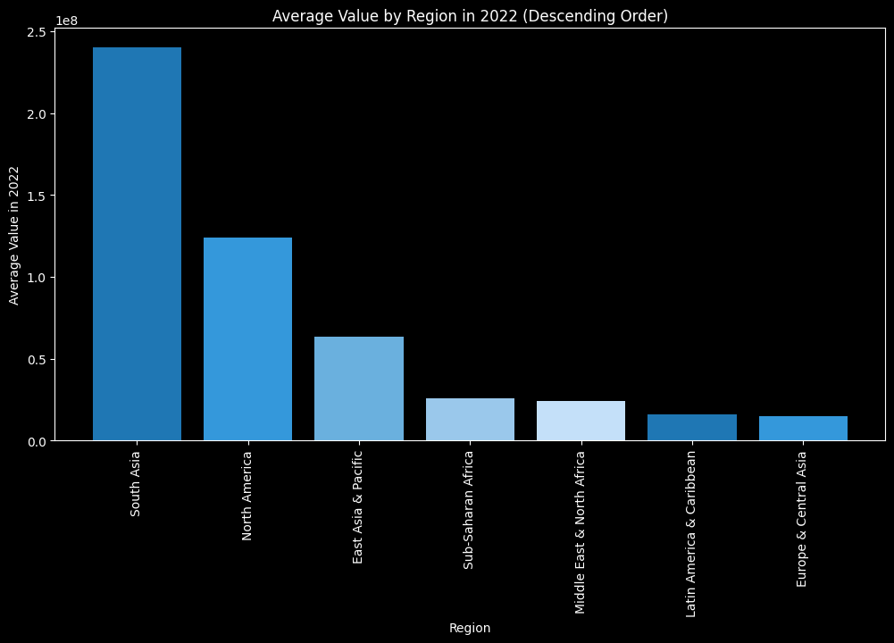

## Unveiling Global Population Dynamics and Socioeconomic Ramifications

### BUSINESS INSIGHTS

In this data science venture, our aim is to delve into global population trends, offering profound insights into their potential socioeconomic consequences through an extensive dataset analysis. The key objectives encompass:

The objective of this data science project is to:

analyze global population trends and understand their potential socioeconomic implications using a comprehensive dataset
provide insights into how population growth and distribution have evolved over time and how they correlate with different socioeconomic factors.

- **Exploring Population Trends**: Delve into global population trends over various decades to discern patterns and evolutions.
- **Understanding Socioeconomic Correlations**: Unravel the intricate correlations between population growth, distribution, and diverse socioeconomic factors.

### DATA INSIGHTS

Our dataset, sourced from The World Bank website's Population section, encapsulates a comprehensive array of information regarding the population dynamics of numerous countries over several decades. The dataset comprises crucial details such as region, income group, and unique identifiers for each country. Key columns include:

The datasets is obtained from The World Bank website Population

The dataset contains information about the population of various countries over several decades, along with additional details such as region and income group.
Columns of the population dataset include:

Country Name : The name of the country or region.
Country Code: A unique code or identifier for each country or region.
Indicator Name: The name of the indicator or measurement, which in this case is "Population, total."
Indicator Code: A code that identifies the specific indicator, which is "SP.POP.TOTL" for total population.
The columns from the metadata:

IncomeGroup: The income group to which the country belongs, such as "High income" or "Low income." Similar to the 'Region' column, not all countries have this information (indicated by NaN).

SpecialNotes: Additional notes or information related to the country. This column contains text descriptions that may provide context or explanations for specific countries or regions.

TableName: The name of the country or region.

- **Country Name & Country Code**: Identifiers for each country or region.
- **Indicator Name & Indicator Code**: Indicators for total population measurement.
- **Income Group**: Categorization based on income level (e.g., "High income," "Low income").
- **Special Notes & Table Name**: Additional notes and names of countries or regions.

### ANALYSIS HIGHLIGHTS

#### Average Population by Region in 2022

**Insights:**
- **South Asia Dominance**: Notably, South Asia emerges as the region with the highest population in 2022, surpassing other global regions.
- **High-Population Regions**: The top-ranking regions signify areas characterized by dense populations, potentially comprising populous nations and urban hubs.
- **Low-Population Regions**: Conversely, regions with lower average populations may denote sparsely populated territories and smaller nations.
- **Socioeconomic Considerations**: High-population regions like South Asia may encounter multifaceted challenges encompassing resource allocation, infrastructure enhancement, healthcare provisioning, and educational advancements. Policymakers must address these challenges comprehensively to ensure the holistic well-being of their populace.

This insightful analysis not only illuminates prevailing population dynamics but also underscores the imperative for proactive policymaking to navigate the socioeconomic complexities associated with global population trends.

Instructions
Clone the repository to your local machine.
Ensure you have Python and necessary libraries installed.
Open and run the Jupyter Notebook Traffic_Accident_Analysis.ipynb to view the analysis process and results.
Feel free to explore, modify, or extend the analysis as per your requirements.

For any questions or feedback, please contact Sufyan Ahmad at sufianjellani@gmail.com.
LinkedIn: https://www.linkedin.com/in/sufyanahmad007/

Thank you for your interest!